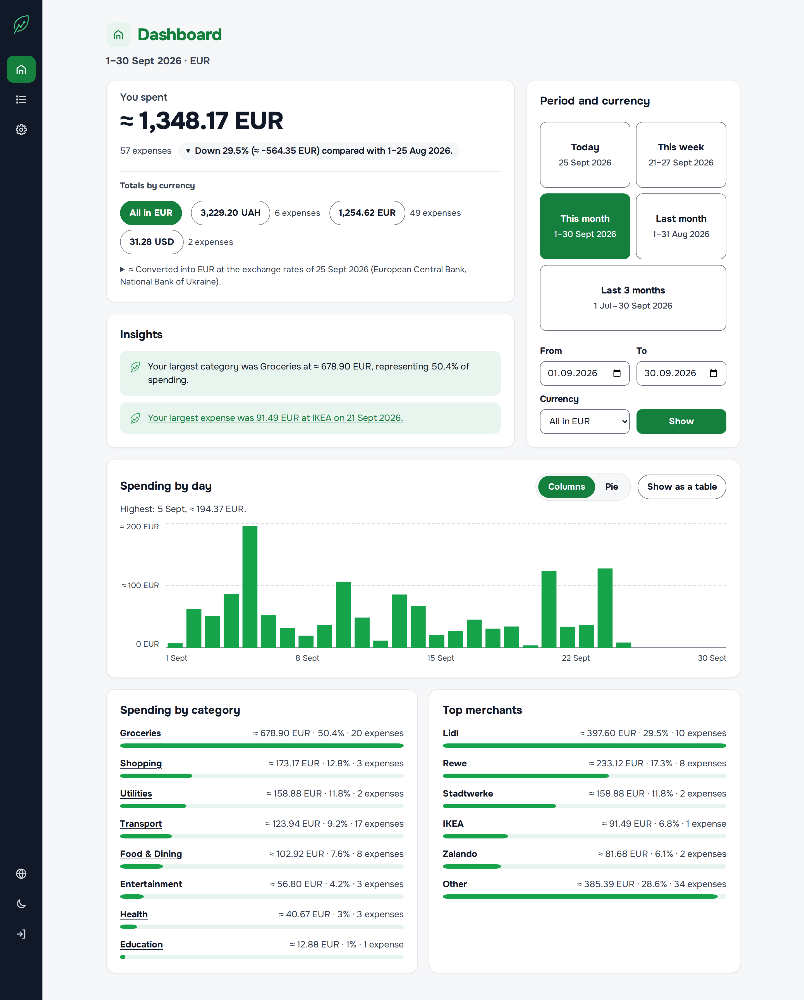
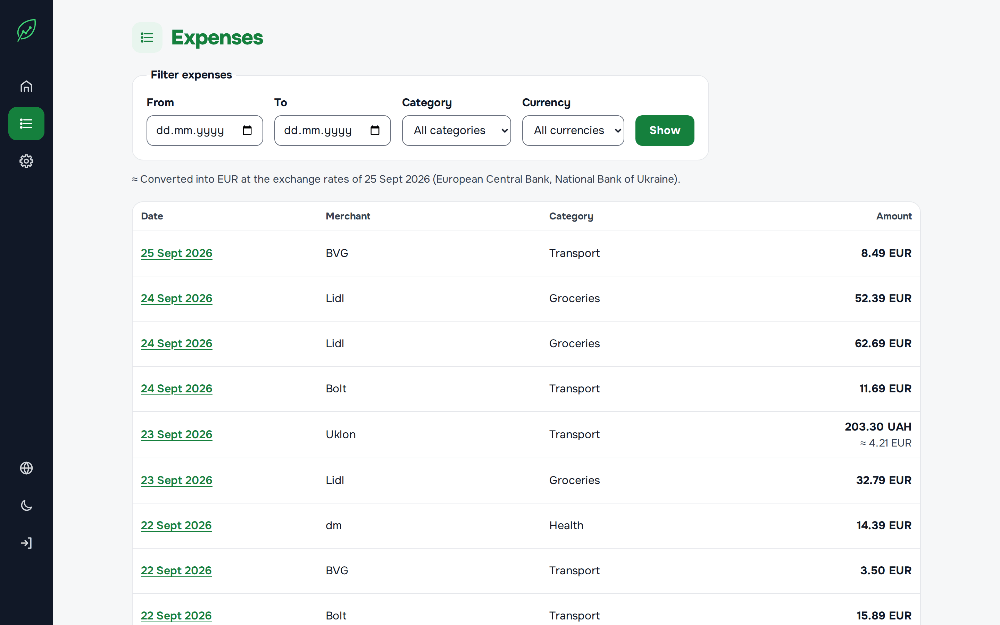
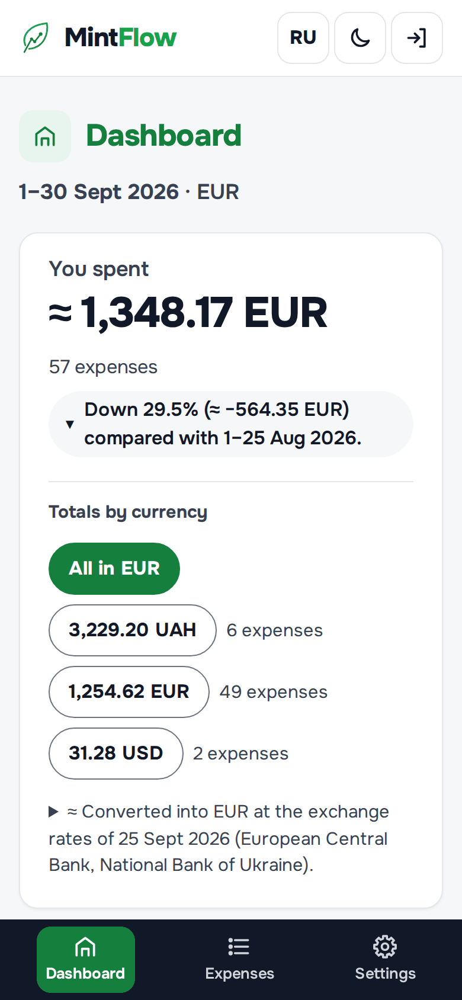
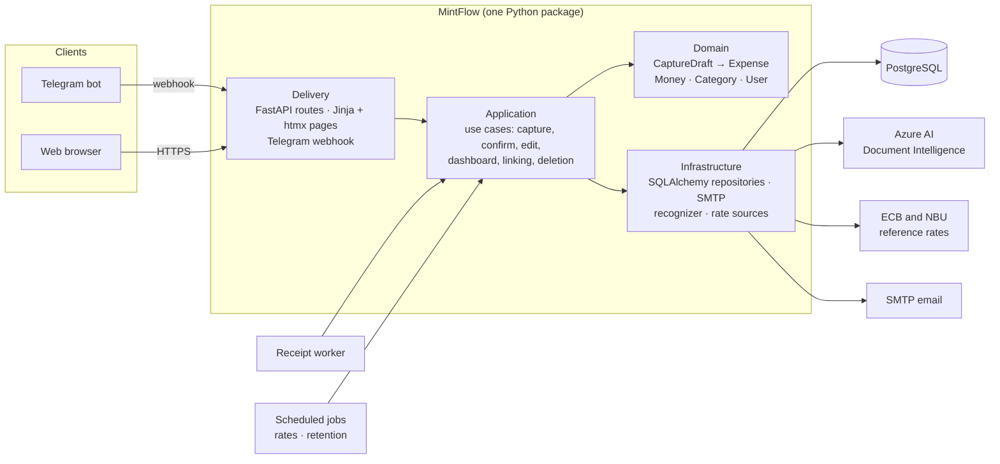

<p align="center">
  
</p>

<h1 align="center">MintFlow</h1>

<p align="center"><strong>Capture in Telegram. Understand on the Web.</strong></p>

<p align="center">
  <a href="https://github.com/vladyslav-fdnk/MintFlow/actions/workflows/ci.yml"></a>
  
  
</p>

MintFlow is a personal expense tracker with two clients over one platform. A Telegram bot
records an expense in a few taps, or from a photo of the receipt. A web app shows where the money
went: totals, trends, categories, merchants, and a full editable history, in several currencies at
once.

<picture>
  <source media="(prefers-color-scheme: dark)" srcset="docs/images/dashboard-dark.png">
  
</picture>

<sub>The screenshots use generated demo data.</sub>

## What it does

**Telegram bot: fast capture**

- `/add` walks through amount, merchant, category, and date, with buttons wherever a choice is
  finite. Amounts can be typed as `12.50`, `12,50`, or `12.50 EUR`.
- A photo of a receipt becomes a draft: the recognizer proposes the amount, date, and merchant,
  and the bot asks only for what it could not read. If reading takes too long, manual entry takes
  over.
- Nothing is saved until you press **Confirm** on the review card. Pressing it twice never
  creates a second expense.
- `/recent` shows the last ten expenses; `/cancel` drops the draft in progress.
- The bot is linked to a web account through a short-lived, single-use challenge confirmed from
  the web session. It only ever talks in private chats.

**Web app: understanding**

- Sign-in by magic link sent to your email. There are no passwords.
- A dashboard for today, this week, this month, last month, the last three months, or any range:
  the total and its change against the previous period, totals per currency, spending by day
  (columns, pie, or an accessible table), by category, and top merchants.
- Several currencies stay separate. On request they are converted into one main currency at the
  day's reference rates of the European Central Bank and the National Bank of Ukraine, and every
  converted value is marked `≈`.
- The expense history can be filtered by date, category, and currency. Every expense can be
  edited, deleted, and restored, and each change is recorded.
- Settings: time zone, default currency, language (English or Russian), the Telegram link, and
  account deletion.
- Light and dark themes, a layout that works on a phone, and keyboard and screen-reader access
  checked against [`docs/web_accessibility_checklist.md`](docs/web_accessibility_checklist.md).

<table>
  <tr>
    <td width="72%"></td>
    <td width="28%"></td>
  </tr>
</table>

## Architecture

MintFlow is a modular monolith. The domain holds the business rules and knows nothing about
HTTP, Telegram, SQL, or OCR. Use cases in the application layer orchestrate it. Delivery channels
and external services stay at the edges.



Two ideas carry the design:

- **A draft is not an expense.** `CaptureDraft` is mutable, unconfirmed input from any channel.
  Only an explicit confirmation turns it into an `Expense`, the record that counts.
- **Recognition is replaceable.** The receipt recognizer is a boundary that only proposes values.
  Azure AI Document Intelligence implements it today; a fake implementation serves development and
  tests.

The design documents in [`docs/`](docs) record each decision with its alternatives and
trade-offs.

## Technology

| Area | Choice |
|---|---|
| Language and tooling | Python 3.13, uv, Ruff, mypy, pytest, pre-commit |
| Web | FastAPI, Jinja templates, htmx, server-rendered SVG charts, Babel for translations |
| Data | PostgreSQL 17, SQLAlchemy 2, Alembic migrations |
| Telegram | A small typed Bot API client over httpx; a webhook in production, long polling locally |
| Receipts | Azure AI Document Intelligence (prebuilt receipt model) behind a recognizer interface |
| Operations | Docker Compose, Caddy with automatic HTTPS, images in GHCR, cron and Healthchecks.io, encrypted `pg_dump` backups to S3-compatible storage |
| CI | GitHub Actions: formatting, lint, types, and tests on every push; an image is published for each commit to `main` |

## Running locally

Prerequisites: Git, [uv](https://docs.astral.sh/uv/), Docker, and Docker Compose.

```bash
make setup                               # .venv, dependencies, .env from .env.example, Git hooks
docker compose up -d postgres mailpit    # PostgreSQL on port 55432, Mailpit on 8025
uv run alembic upgrade head              # create the schema
make run                                 # http://localhost:8000
```

Change the example secrets in `.env`; the file is ignored by Git.

- **Signing in.** Request a link at `http://localhost:8000`, then open Mailpit at
  `http://localhost:8025` and follow the link in the message. Local email never leaves the
  machine.
- **The bot.** Create a bot with [@BotFather](https://t.me/BotFather), set the three
  `MINTFLOW_TELEGRAM_*` variables in `.env`, and run
  `uv run python -m mintflow.commands.telegram_polling` next to `make run`. Link it from Settings.
- **Receipts.** The fake recognizer reads nothing, so every receipt falls back to manual entry.
  To read real receipts, set `MINTFLOW_RECEIPT_RECOGNIZER=azure` with an Azure endpoint and key
  (the free F0 tier allows 500 pages a month), and run
  `uv run python -m mintflow.commands.receipt_worker`.
- **Exchange rates.** `uv run python -m mintflow.commands.refresh_exchange_rates` fetches the
  day's ECB and NBU rates.

Health checks are served at `/health/live` and `/health/ready`; the API documentation is at
`/docs` when `MINTFLOW_ENABLE_API_DOCS=true`.

## Commands

| Command | Purpose |
|---|---|
| `make setup` | Install dependencies, prepare `.env`, and install Git hooks. |
| `make run` | Run the app locally with reload. |
| `make check` | Run every quality gate: formatting, lint, types, and tests. |
| `make format` | Format the code and apply safe Ruff fixes. |
| `make test` | Run pytest. Integration tests need `MINTFLOW_TEST_DATABASE_URL`. |
| `make translations` | Refresh the web translation catalogues and list missing strings. |
| `make docker-up` / `make docker-down` | Start or stop the app, PostgreSQL, and Mailpit in Docker. |
| `make image-check` | Build the production image and check that it runs as non-root and becomes healthy. |
| `make backup-check` | Back up a throwaway database to a local S3 server, restore it, and compare row counts. |

## Deployment

Production runs on a single server from [`deploy/`](deploy): Caddy terminates HTTPS in front of
the app, a worker processes receipts, and host cron runs the scheduled jobs and nightly
age-encrypted backups. Each commit to `main` that passes CI is published as
`ghcr.io/vladyslav-fdnk/mintflow:<commit SHA>`. In production the app refuses to start with
development settings, such as API docs enabled, a non-HTTPS origin, or the fake recognizer.
[`docs/operations_design.md`](docs/operations_design.md) explains the setup.

## Status

The MVP loop works end to end: sign-in, Telegram linking, manual and receipt capture, the
dashboard with currency conversion, the editable history, and account deletion. It is covered by
about 1,700 tests. What remains before a public launch:

- evaluating receipt recognition on real receipts;
- the first production deployment and its runbook;
- a privacy notice.

## Documentation

- [`docs/mvp_definition.md`](docs/mvp_definition.md): MVP scope, user journeys, requirements, and success criteria.
- [`docs/domain_design_proposal.md`](docs/domain_design_proposal.md): the ubiquitous language, invariants, and lifecycle.
- [`docs/product_decision_review.md`](docs/product_decision_review.md): product decisions and their alternatives.
- Design documents for each area: authentication, Telegram, receipts, dashboard, exchange rates, web client, operations, and account deletion.
- [`docs/tasks/`](docs/tasks): every implementation task, with its acceptance criteria; `index.yaml` tracks their status.
- [`AGENTS.md`](AGENTS.md): working rules for AI coding assistants on this repository.
