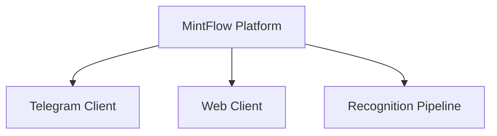

# MintFlow

MintFlow is a personal expense platform designed to make expense capture effortless and spending review trustworthy.

> Capture in Telegram. Understand on the Web.

The MintFlow Platform combines a fast Telegram Client capture flow with a focused Web Client for history, correction, and spending summaries. It is built for people who want more structure than notes and less friction than spreadsheets or traditional expense trackers.

## Project vision

MintFlow turns everyday expense capture into reliable financial understanding. Users can enter an expense manually or submit a receipt, review a mutable draft, and explicitly confirm it before it enters their financial history.

The initial goal is a commercially credible product for the first 100 users. Product success means repeated capture, dashboard returns, trust in stored data, and preference over manual notes or spreadsheets.

## Product philosophy

- The Telegram Client is optimized for capture.
- The Web Client is optimized for understanding.
- The MintFlow Platform, not either client alone, is the product.
- Confirmation is mandatory because convenience must not compromise financial truth.
- Multiple currencies remain explicit and are never silently combined or converted.
- Scope stays intentionally narrow until the core product loop is validated.

## Architecture overview

MintFlow follows a modular-monolith architecture. Business rules remain in the domain, while delivery channels and external services stay at the boundaries.

`CaptureDraft` represents mutable, unconfirmed input. `Expense` represents confirmed financial truth. The Recognition Pipeline is infrastructure that proposes values from receipt content without coupling the domain to OCR, vision models, parsers, heuristics, merchant normalization, or any other recognition technology.

The Telegram Client and Web Client operate on the same domain model and confirmed financial records.



## Technology stack

- **Python 3.13** with **uv** for reproducible dependency and virtual-environment management.
- **FastAPI** as the typed application framework.
- **PostgreSQL** as the local infrastructure dependency; Foundation Sprint creates no schema or persistence layer.
- **pydantic-settings** for validated environment configuration.
- **Ruff**, **mypy**, **pytest**, and **pre-commit** for automated quality checks.
- **Docker Compose** for the local application and PostgreSQL environment.
- **GitHub Actions** for pull-request validation.

The backend remains a modular monolith. The Recognition Pipeline, Telegram Client, and Web Client will be integrated later without moving business rules out of the domain.

## Repository structure

```text
MintFlow/
├── .github/    # Continuous-integration workflows
├── docs/       # Approved product and domain specification
├── src/        # Installable MintFlow application package
├── tests/      # Automated tests and shared pytest fixtures
├── AGENTS.md   # Permanent working rules for AI assistants
├── compose.yaml
├── Dockerfile
├── Makefile    # Stable entry points for development tasks
├── pyproject.toml
└── README.md
```

Only directories with a current responsibility are present. Future modular-monolith boundaries should be added when real application responsibilities require them, not as empty placeholders.

## Roadmap

1. **Product Discovery — complete.** Product scope, MVP behavior, domain boundaries, and key decisions are documented.
2. **Foundation Sprint v0.1 — next.** Establish engineering infrastructure and approved technical foundations without expanding product scope.
3. **MVP implementation.** Deliver the confirmed capture, review, expense history, and dashboard loop for the first 100 users.
4. **Post-MVP.** Evaluate postponed capabilities only after evidence from real product use. These include data export, merchant search, and user-defined categories.

## Project Status

- **Current milestone:** Foundation Sprint v0.1
- **Current stage:** Foundation polish before the first commit
- **Engineering status:** Application shell, local environment, health checks, and quality gates are ready
- **Business feature status:** Not started; no business features are implemented

## Local setup

Prerequisites: Git, uv, Docker, and Docker Compose.

```bash
make setup
make check
make docker-up
```

`make setup` creates the project-local `.venv`, installs locked dependencies, copies `.env.example` to `.env` when needed, and installs Git hooks. Change the example PostgreSQL password in `.env`; the file is ignored by Git.

PostgreSQL is exposed on host port `55432` by default to avoid conflicting with a system installation. Set `POSTGRES_PORT` and update `MINTFLOW_DATABASE_URL` together if another port is required.

After `make docker-up`, liveness is available at `http://localhost:8000/health/live` and readiness at `http://localhost:8000/health/ready`. Readiness returns success only when PostgreSQL accepts a query. API documentation is available at `http://localhost:8000/docs` in the example development configuration. Set `MINTFLOW_ENABLE_API_DOCS=false` in production; documentation is disabled by default when the option is absent.

Local authentication email is captured by Mailpit and is never sent to real recipients. Open
`http://localhost:8025`, select the message for the submitted address, and follow the sign-in link in
its text body. The Mailpit backend must be selected explicitly and is rejected in staging and
production configuration.

Use `make docker-down` to stop the environment. The PostgreSQL Docker volume is retained intentionally.

## Available commands

| Command | Purpose |
|---|---|
| `make setup` | Install dependencies, prepare local configuration, and install hooks. |
| `make format` | Format Python and apply safe Ruff fixes. |
| `make lint` | Check formatting and lint rules without modifying files. |
| `make typecheck` | Run the practical mypy baseline. |
| `make test` | Run pytest. |
| `make check` | Run all local quality gates. |
| `make run` | Run the application locally with reload. |
| `make hooks` | Run every pre-commit hook against the repository. |
| `make docker-up` | Build and start the application and PostgreSQL. |
| `make docker-down` | Stop the Docker environment. |
| `make docker-logs` | Follow application container logs. |
| `make image-check` | Build the production image and check it runs as non-root and reports healthy. |

Production runs from `deploy/` (Compose, Caddy, and an example server environment); see
`docs/operations_design.md`. CI publishes `ghcr.io/vladyslav-fdnk/mintflow:<commit SHA>` from
`main`.

## Development workflow

1. Run `make setup` after cloning.
2. Start from approved product and architecture documentation.
3. Record material architectural decisions and explain their trade-offs.
4. Implement the smallest coherent increment without silently changing product behavior.
5. Add tests for business rules and critical workflows.
6. Run `make check` before proposing a small, focused commit.
7. Update existing documentation only when an approved decision or behavior changes.

Pull requests run formatting checks, linting, the practical mypy baseline, and tests. Strictness should increase incrementally as modules mature; full global mypy strict mode is intentionally deferred.

## Contributing

Contributions should preserve the approved product philosophy and MVP boundaries. Before making a change:

- Read `AGENTS.md` and the relevant documents in `docs/`.
- Open a focused proposal for changes that affect scope, architecture, or domain language.
- Explain trade-offs and avoid speculative features or unnecessary abstractions.
- Keep changes small, readable, strongly typed, and covered by tests where business rules are involved.
- Update documentation alongside an approved behavior change.

## Documentation index

- [`docs/mvp_definition.md`](docs/mvp_definition.md) — definitive MVP scope, journeys, requirements, metrics, success criteria, and release checklist.
- [`docs/domain_design_proposal.md`](docs/domain_design_proposal.md) — ubiquitous language, domain boundaries, invariants, lifecycle, and initial use cases.
- [`docs/product_decision_review.md`](docs/product_decision_review.md) — product decisions, alternatives, recommendations, and long-term implications.
- [`AGENTS.md`](AGENTS.md) — permanent contribution rules for AI assistants.
