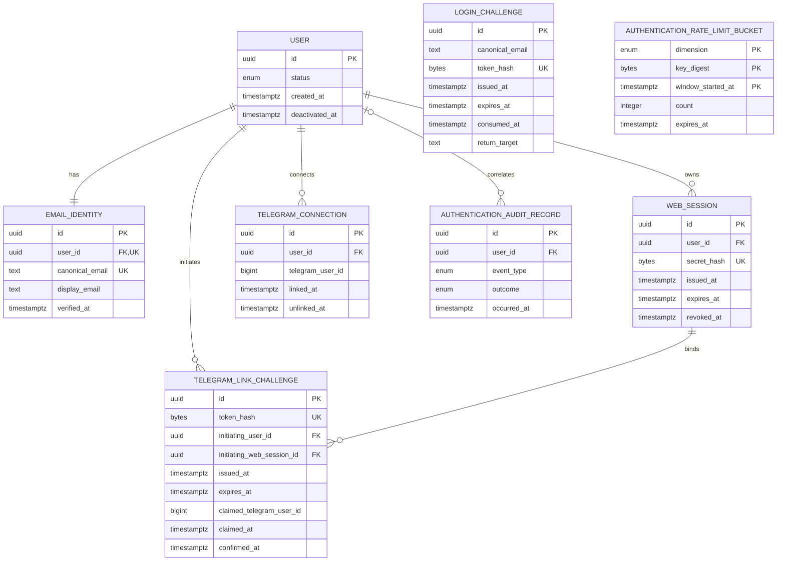

# MintFlow Authentication Persistence Design

Status: approved persistence design. This document refines the approved Authentication Design Proposal into a conceptual PostgreSQL persistence model. It is not a final SQL schema and does not authorize implementation.

## 1. Scope and design principles

This design covers only persistence needed by the approved MVP authentication flows. It preserves `User` as the stable account and financial-ownership boundary. Email and Telegram are ways to authenticate or connect a client; neither is the account itself.

The smallest sound approach is one PostgreSQL database in the modular monolith. PostgreSQL stores durable identity mappings, challenges, sessions, link state, minimal audit evidence, and MVP rate-limit counters. Correctness comes from transactions and database constraints, not application pre-checks. Retention jobs may delete operational authentication data, but must not weaken financial ownership or delete financial records accidentally.

No persistence is proposed for passwords, password reset, social login, passkeys, MFA, multiple emails or Telegram accounts per User, roles, organizations, device-management UI, public API authentication, native mobile authentication, or postponed recovery mechanisms.

## 2. Persistence records

The field lists below are conceptual. Every record has a non-secret primary key such as a UUID generated independently of any credential. Concrete PostgreSQL types and names belong to schema design.

### 2.1 User

- **Responsibility:** stable MintFlow account, authorization boundary, and owner of financial data and domain preferences.
- **Classification:** domain data and aggregate root.
- **Essential fields:** `id`; account `status` (`active` or `deactivated` for MVP); `created_at`; `deactivated_at`; and the preferences already approved in the domain design. A deletion workflow may later require `deletion_requested_at`, but it should not be added before that workflow is approved.
- **Ownership:** owns its identity and connection records conceptually, and owns financial-domain records. Authentication mechanisms do not own the User.
- **Lifecycle:** created only by the first successful Magic Link consumption for a canonical email; active until deactivated. MVP supports deactivation only. Hard deletion and anonymization are postponed until a separate policy is approved.
- **Retention:** follows the account and financial-data policy, not authentication-token retention.
- **PostgreSQL:** yes; this is the existing durable domain owner.

### 2.2 EmailIdentity

- **Responsibility:** map the one verified MVP email identity to a User without treating the address as the User identifier.
- **Classification:** application-supporting identity data.
- **Essential fields:** `id`; `user_id`; `canonical_email`; `display_email`; `verified_at`; `created_at`; and optionally `deactivated_at` only if identities must be retained after deactivation. `display_email` is presentation/contact data, never the comparison key.
- **Ownership:** belongs to one User.
- **Lifecycle:** inserted as verified in the same transaction that consumes the first successful LoginChallenge and creates the User. Self-service replacement is excluded. Account deactivation need not deactivate the identity; login authorization must also check User status.
- **Retention:** retained with the User until an approved deletion/anonymization process removes it. Backups age out according to backup retention.
- **PostgreSQL:** yes; it is the authoritative email-to-User mapping.

An MVP `active` flag is unnecessary while email change and multiple identities are excluded. “One active EmailIdentity” is most simply represented as exactly zero or one row per User, with one globally unique canonical email. If inactive history is later required, add status and partial uniqueness then rather than prebuilding it now.

### 2.3 LoginChallenge

- **Responsibility:** prove temporary control of a canonical mailbox for registration or login.
- **Classification:** infrastructure authentication data.
- **Essential fields:** `id`; `canonical_email`; `token_hash`; `issued_at`; `expires_at`; nullable `consumed_at`; an approved internal `return_target`; and optional coarse request metadata only if justified for abuse investigation. A purpose column is unnecessary while login and first registration use the same flow.
- **Ownership:** no User ownership is required. A challenge deliberately exists before a User may exist. It resolves the User through canonical email only during successful POST consumption.
- **Lifecycle:** issued, then exactly one of successfully consumed or left to expire. GET performs no mutation. A newer challenge does not invalidate an older unexpired challenge in the MVP.
- **Retention:** delete consumed challenges 30 days after `consumed_at` and unconsumed challenges 30 days after `expires_at`; configurable. Audit evidence is separate.
- **PostgreSQL:** yes; durable, atomic single-use behavior is required.

Do not persist delivery outcome in a way that changes public behavior. If operational delivery diagnostics are required, keep minimal provider metadata separate from authentication truth and under an explicit retention policy.

### 2.4 WebSession

- **Responsibility:** server-side authentication state for one browser session.
- **Classification:** infrastructure authentication data.
- **Essential fields:** `id`; `user_id`; `secret_hash`; `issued_at`; absolute `expires_at`; nullable `revoked_at`; nullable revocation reason; and minimal optional security metadata such as coarse user-agent or network-source fingerprints only when operationally justified.
- **Ownership:** belongs to one User; a User has zero or many sessions.
- **Lifecycle:** inserted after successful challenge consumption. It is valid only while unrevoked, unexpired, and its User is active. Login creates a fresh session and fresh cookie secret; it does not extend or revoke other sessions. Logout revokes the current session. Account deactivation revokes all active sessions in the same transaction.
- **Retention:** delete revoked sessions 30 days after `revoked_at` and expired sessions 30 days after `expires_at`; configurable.
- **PostgreSQL:** yes; it is authoritative server-side session state.

`last_seen_at` is deliberately omitted: there is no sliding expiry and writing on every request creates avoidable load and tracking data. It may be added later for a separately approved operational need.

### 2.5 TelegramConnection

- **Responsibility:** authorize one Telegram user ID as the optional Telegram Client connection for one User.
- **Classification:** application-supporting identity/connection data.
- **Essential fields:** `id`; `user_id`; immutable `telegram_user_id`; `linked_at`; nullable `unlinked_at`; and optional non-authoritative display metadata. Authorization uses only the verified numeric Telegram user ID and active state.
- **Ownership:** belongs to one User, but does not establish account ownership.
- **Lifecycle:** created as active only by successful Web confirmation of a claimed TelegramLinkChallenge. Unlinking sets `unlinked_at`. Relinking requires the full new challenge flow and creates a new active record; it never transfers an active connection automatically.
- **Retention:** retain an unlinked TelegramConnection, including its Telegram identifier, for 30 days after unlinking and then delete the row. Pseudonymization is not part of MVP. The 30-day period is configurable.
- **PostgreSQL:** yes; it is an authoritative authorization mapping.

Active means `unlinked_at IS NULL`; a status column would duplicate this fact and permit inconsistent states.

### 2.6 TelegramLinkChallenge

- **Responsibility:** coordinate the two-step link ceremony between the initiating authenticated Web session and a verified private-chat Telegram claimant.
- **Classification:** infrastructure workflow data.
- **Essential fields:** `id`; `token_hash`; `initiating_user_id`; `initiating_web_session_id`; `issued_at`; `expires_at`; nullable `claimed_at`; nullable `claimed_telegram_user_id`; nullable `confirmed_at`; and nullable terminal failure/cancellation metadata only if operationally necessary.
- **Ownership:** bound to exactly one User and exactly one initiating WebSession. The session must belong to that User.
- **Lifecycle:** issued by an active Web session; claimed once by a Telegram user in a verified private chat; confirmed once by the same still-valid initiating Web session; then retained temporarily. Expiry prevents claim and confirmation. Claim is not an active connection.
- **Retention:** delete 30 days after confirmation, expiry, or other terminal state; configurable.
- **PostgreSQL:** yes; cross-client, single-use transitions require durable transactional state.

### 2.7 AuthenticationAuditRecord

- **Responsibility:** retain minimal, non-secret evidence of security-relevant outcomes without becoming an event-sourcing system or a second source of authentication truth.
- **Classification:** infrastructure operational/audit data.
- **Essential fields:** `id`; `occurred_at`; constrained `event_type`; nullable `user_id`; nullable non-secret subject record ID; `outcome`; and privacy-reduced network-source fingerprint when justified. Examples are login challenge requested, login succeeded or failed, logout, all-sessions revoked, Telegram claim, link confirmed, unlink, and account deactivation.
- **Ownership:** not aggregate-owned. `user_id` is an optional correlation, because request and failure events may predate a User.
- **Lifecycle:** append-only from application use cases after or within their authoritative transaction as described below. It must not be queried to determine current authorization state.
- **Retention:** 90 days, configurable, then delete. Longer security retention requires separate approval.
- **PostgreSQL:** yes for MVP simplicity.

Audit records must not contain raw tokens, token hashes, cookie secrets, complete Magic Links, email content, arbitrary request bodies, or full redirect URLs. Storing canonical email in audit is unnecessary; where correlation is required, use a keyed privacy-preserving fingerprint with independently managed key rotation, or accept reduced correlation for MVP.

### 2.8 AuthenticationRateLimitBucket

- **Responsibility:** enforce fixed-window delivery and network-source login-request limits atomically.
- **Classification:** infrastructure operational data.
- **Essential fields:** `dimension` (`email_delivery` or `network_request`); `key_digest`; `window_started_at`; `count`; `expires_at`; and optionally `updated_at`. The composite of dimension, digest, and window start identifies a bucket.
- **Ownership:** none; it is ephemeral operational state.
- **Lifecycle:** atomically inserted or incremented for the applicable fixed 15-minute window. Email delivery is counted when an email is accepted for delivery, not merely requested. Network requests are counted for every login request before account lookup or delivery behavior can leak existence.
- **Retention:** up to 24 hours, configurable, then delete.
- **PostgreSQL:** yes for MVP. Redis is unnecessary for the first 100 users.

## 3. Relationships and cardinality

- `User` to `EmailIdentity`: one User has exactly one EmailIdentity after creation; an EmailIdentity belongs to exactly one User. During database insertion, deferrable or transaction-level timing may briefly leave neither committed; no committed User created by authentication should lack its identity.
- `User` to `WebSession`: one-to-many; a User may have zero active sessions.
- `User` to `TelegramConnection`: one-to-many historically, but zero-or-one active connection. Historical unlinked rows exist only during retention.
- `LoginChallenge` to `User`: intentionally no foreign key. Zero or one User may be resolved by canonical email at consumption time.
- `TelegramLinkChallenge` to `User`: many-to-one, mandatory.
- `TelegramLinkChallenge` to initiating `WebSession`: many-to-one, mandatory; the session must belong to the same User. A composite database foreign key is preferable if the session exposes a unique `(id, user_id)` pair; otherwise lock and verify both records transactionally, because ordinary foreign keys cannot express cross-table ownership.
- `AuthenticationAuditRecord` to `User`: optional many-to-one correlation with deletion behavior that preserves or removes audit independently according to approved privacy policy.
- Rate-limit buckets have no foreign keys to User or EmailIdentity.

Account deletion is defined separately in `docs/account_deletion_design.md` (approved
2026-09-24): it removes every row the user owns in one transaction, and
`authentication_audit_records.user_id` became `ON DELETE SET NULL` so audit evidence outlives the
account without pointing at it. The statements below about deactivation still hold.

Account deactivation is not deletion: it preserves all ownership, rejects future login/session use, revokes every active session, makes every pending TelegramLinkChallenge unusable, and immediately unlinks the active TelegramConnection. If reactivation is introduced later, Telegram must be linked again through the complete ceremony. Hard deletion and anonymization are outside MVP. Authentication foreign keys must use conservative behavior and must not cascade from authentication tables into User, `Expense`, `CaptureDraft`, `Receipt`, or other financial data.

## 4. Required database constraints

### 4.1 Identity and credential constraints

- `EmailIdentity.canonical_email` is `NOT NULL` and globally unique. Canonicalization occurs before persistence using one approved deterministic rule; the database stores and compares only its result. PostgreSQL `citext` is not a substitute for that rule.
- `EmailIdentity.user_id` is `NOT NULL`, a foreign key, and unique. This directly enforces at most one identity per User in the MVP. The first-login transaction establishes exactly one for newly created Users.
- `LoginChallenge.token_hash`, `WebSession.secret_hash`, and `TelegramLinkChallenge.token_hash` are each `NOT NULL`, fixed-length hash values, and unique within their own credential namespace. Global uniqueness across tables is unnecessary because raw secrets are generated independently and interpreted by endpoint context.
- Hash lengths are constrained to exactly 32 bytes when stored as binary SHA-256 output. Encoding belongs at the adapter boundary, not in the conceptual secret.
- `expires_at > issued_at`; consumed, claimed, confirmed, revoked, linked, and unlinked timestamps cannot precede issuance or linkage as applicable.
- `WebSession.user_id` is a non-null foreign key. `secret_hash` is globally unique. `expires_at` is immutable after creation and no later than `issued_at + 30 days` under the configured maximum. Configuration may shorten, never exceed, that maximum.

### 4.2 Active-connection constraints

- `TelegramConnection` has a partial unique index on `user_id WHERE unlinked_at IS NULL`.
- It also has a partial unique index on `telegram_user_id WHERE unlinked_at IS NULL`.
- `TelegramConnection` requires `linked_at IS NOT NULL` and `unlinked_at IS NULL OR unlinked_at >= linked_at`.

These partial indexes preserve short-lived unlinked history while enforcing both active cardinalities. They also make concurrent relinking safe without relying on a pre-check.

### 4.3 Single-success state constraints

A nullable terminal timestamp is a monotonic state marker, not a counter. Exactly one successful LoginChallenge consumption is enforced by an atomic conditional update such as changing `consumed_at` only where it is null and the challenge is unexpired, then requiring exactly one returned row. The transaction that wins creates/resolves the User and creates a session; all other attempts affect zero rows. Uniqueness of `token_hash` ensures one challenge row.

Telegram claim similarly performs one conditional update from `claimed_at IS NULL` to a complete claim tuple. A check constraint requires `claimed_at` and `claimed_telegram_user_id` to be both null or both non-null. Confirmation conditionally sets `confirmed_at` only where it is null, a complete claim exists, the challenge is unexpired, and the initiating session/user binding is valid. A check requires confirmation to imply claim and `confirmed_at >= claimed_at`. Exactly one returned row represents success.

No generic “used” boolean is needed. Timestamps express the only successful transition and retain useful evidence.

### 4.4 Concurrent first-login constraint

The global unique constraint on `EmailIdentity.canonical_email` is the final guard against duplicate accounts. During first consumption, inserting `User` and `EmailIdentity` occurs in one transaction. If concurrent valid challenges for the same previously unseen email are consumed, only one identity insert may win. The losing transaction must recover by rolling back its provisional User, re-resolving the winning EmailIdentity, and completing a returning-login transaction without attempting to consume the already committed challenge twice.

An implementation may serialize account creation more simply with a transaction-scoped PostgreSQL advisory lock derived from the canonical email, followed by re-query under the lock. The unique constraint remains mandatory. A separate “email registration lock” table is premature.

## 5. Concurrency and transaction boundaries

All timestamps used in a transaction come from one injected-clock value or a consistent database transaction timestamp. Public responses remain generic even when a constraint conflict or invalid state occurs.

### 5.1 First Magic Link consumption and User creation

On POST, hash the presented token, begin a transaction, and atomically claim the unconsumed, unexpired LoginChallenge. Serialize by canonical email (recommended: transaction advisory lock), then query EmailIdentity. If absent, insert User and EmailIdentity; if present, follow returning login. Insert a fresh WebSession and the success audit record, then commit. Only after commit send the raw session secret to the cookie adapter. A rollback leaves the challenge unconsumed and must not expose a session cookie.

The database unique canonical-email constraint handles any missed race. Constraint conflict handling must roll back the whole transaction before retrying; it must not leave an orphan User.

### 5.2 Returning login

Atomically claim the challenge, resolve EmailIdentity, lock or reliably read its User, and require the User to be active. Insert a new WebSession and success audit record in one transaction. Do not revoke other sessions and do not update their expiry. For a deactivated User, no session is created; the externally visible result remains generic.

### 5.3 Duplicate or concurrent token consumption

The conditional challenge update is the serialization point. Exactly one transaction obtains the row. A second POST, including one racing before the first commits, blocks or returns zero affected rows after the winner commits. It produces the same user-facing invalid result as unknown, expired, or already consumed tokens.

### 5.4 Session creation and login rotation

Generate a fresh raw session secret before insertion, store only its hash, and insert it in the same transaction as successful authentication. Retry generation on the practically impossible unique-hash conflict. “Rotate session state” means never promote or reuse a pre-authentication cookie/session identifier. Any anonymous return/CSRF state is separate and is invalidated or replaced at login. The authenticated session cookie is emitted only after commit.

### 5.5 Telegram challenge claim

Hash the raw link token and begin a transaction. Atomically update an unclaimed, unconfirmed, unexpired challenge with `claimed_at` and the Telegram user ID. The Telegram adapter must already have verified a private-chat update and authoritative sender ID. Claim performs no TelegramConnection insert and no transfer. Concurrent claims produce one winner.

### 5.6 Telegram final confirmation

Begin a transaction from the authenticated, CSRF-protected Web request. Lock or conditionally select the challenge and initiating session. Require: claimed but unconfirmed challenge; not expired; current Web session ID equals the initiating session ID; session belongs to the initiating User, is unrevoked/unexpired; and User is active. Attempt to insert the active TelegramConnection and conditionally mark the challenge confirmed in the same transaction. The two partial unique indexes reject conflicts with either User or Telegram ID. On conflict, roll back confirmation and connection together; do not transfer or unlink anything. Commit the link audit record atomically.

### 5.7 Relinking

Relinking after unlink follows the complete claim and confirmation flow. The final transaction locks the relevant User/current active connection state and relies on partial unique indexes. After the 30-day history period, a deleted old row has no role. Relinking an identifier still active for another User fails generically and requires that other User to unlink first; no automatic transfer occurs.

### 5.8 Unlinking

In one authenticated, CSRF-protected transaction, conditionally set `unlinked_at` on the requesting User's active TelegramConnection and append audit evidence. Require exactly one affected row for a successful unlink; repeated requests are idempotently non-successful or return the already-unlinked product result without modifying another User's connection.

### 5.9 Account deactivation

Lock the User, transition active to deactivated once, set `revoked_at` on every unrevoked WebSession, invalidate or terminally mark every unconfirmed TelegramLinkChallenge, set `unlinked_at` on the active TelegramConnection, and append audit evidence in one transaction. Authorization still checks User status, so no race can preserve access through a session that was read concurrently. Any future reactivation must not restore the old Telegram connection; the User must complete a new linking ceremony.

## 6. Secret storage and credential boundaries

For every Magic Link or Telegram link, the generator creates an opaque random token with at least 256 bits of entropy. The raw token exists only transiently in application memory long enough to build the outbound link. SHA-256 of the exact raw token is persisted. On presentation, hash the candidate and query by the fixed-length hash. The raw token is not a record ID.

For a Web session, generate a new opaque cookie secret with at least equivalent entropy. The browser receives it only in the production `__Host-` cookie configured `HttpOnly`, `Secure`, `SameSite=Lax`, `Path=/`, and without `Domain`. PostgreSQL stores only SHA-256 of the cookie secret. The session row ID is non-secret internal correlation and must not authenticate by itself.

Raw challenge tokens, raw session secrets, full Magic Links, cookie headers, and URLs containing credentials must never be stored in PostgreSQL, audit records, logs, traces, analytics, exception messages, or email-provider metadata controlled by MintFlow. Token hashes and session hashes should also be excluded from logs: although not directly usable as bearer credentials, they enable correlation and are unnecessary operational output. Logging filters and structured-field allowlists are required at implementation time.

Approved return targets are non-secret route identifiers or validated relative paths. Persist the normalized approved representation, never an arbitrary external URL.

## 7. Time handling

Persist timezone-aware UTC instants for every `issued_at`, `expires_at`, `consumed_at`, `revoked_at`, `linked_at`, `unlinked_at`, `claimed_at`, `confirmed_at`, audit `occurred_at`, retention boundary, and domain account timestamp. PostgreSQL `timestamp with time zone` semantics are appropriate; adapters should normalize values to UTC. Never use local wall-clock time or timezone-naive values in authentication decisions.

Application use cases receive a `Clock` abstraction. Production reads real UTC; tests inject a fixed or manually advancing clock to exercise exact expiry boundaries deterministically. Define validity consistently as `now < expires_at`; at `now == expires_at`, the credential is expired. Database conditional updates must use the same captured `now` passed by the application, or consistently use the database transaction timestamp—not a mixture that creates boundary races.

Retention jobs use the same clock policy and delete in bounded batches. Created/issued timestamps are immutable. Absolute session expiry is never advanced.

## 8. Deletion, retention, and backups

Run idempotent scheduled cleanup jobs, safe under concurrent execution and bounded by indexed retention timestamps:

- Delete consumed LoginChallenges 30 days after consumption and unconsumed ones 30 days after expiry.
- Delete TelegramLinkChallenges 30 days after confirmation, expiry, or terminal invalidation.
- Delete revoked WebSessions 30 days after revocation and expired ones 30 days after expiry.
- Delete unlinked TelegramConnection rows 30 days after unlink. Do not pseudonymize them for MVP.
- Delete rate-limit buckets after their configured expiry and never retain them beyond 24 hours.
- Delete AuthenticationAuditRecords after 90 days.

Retention configuration may shorten operational retention where safe. Increasing privacy-sensitive retention should be treated as a policy change, not an unnoticed environment tweak.

Foreign-key deletion behavior should be conservative:

- Authentication child records should not cascade-delete User.
- Deleting challenges, sessions, connections, buckets, or audit rows must never cascade into User or financial tables.
- MVP does not delete User rows. Foreign keys referencing User use conservative restrictive behavior; no destructive User deletion behavior is designed yet.
- LoginChallenges and rate-limit buckets have no User foreign key and therefore remain governed solely by their retention schedules.
- TelegramLinkChallenges, WebSessions, EmailIdentity, TelegramConnection, and AuthenticationAuditRecord must not introduce cascading or `SET NULL` behavior for hypothetical User deletion. Use conservative restrictive foreign keys for MVP.
- Whether future User deletion clears or deletes audit correlation is explicitly postponed to the future account deletion/anonymization policy.

Backups are not online retention exceptions. Deleted data may remain in encrypted backups until normal backup expiry, must not be selectively restored into production outside a documented disaster-recovery procedure, and must be deleted again by cleanup after a full restore. Backup duration, access, restoration logging, and erasure disclosure belong in the deployment/privacy policy and must be known before production.

## 9. Rate-limit persistence in PostgreSQL

Use fixed 15-minute buckets. This is simpler and sufficiently correct for MVP, though less smooth than a rolling window.

### Keys and privacy

- Email delivery key: a keyed HMAC digest of the canonical email, namespaced as `email_delivery`. Do not use plain SHA-256 for low-entropy email addresses because it is vulnerable to offline guessing.
- Network request key: a keyed HMAC digest of the normalized network source, namespaced as `network_request`. The source is typically the trusted client IP derived only through configured proxy boundaries. Do not store raw IP unless a separately justified security requirement outweighs privacy cost.
- Manage the HMAC key outside the database. Key rotation may temporarily reset or split counters, which is acceptable if planned; include a non-secret key-version in the dimension when needed.

### Atomic increment and enforcement

For each request, compute the UTC bucket start and perform an atomic PostgreSQL upsert: insert count 1, or increment the existing row, returning the new count. The composite unique key `(dimension, key_digest, window_started_at)` prevents duplicate buckets. The network-source counter is checked against 30 requests. The email-delivery counter is incremented only when a delivery is actually accepted for sending and is checked against 3 delivered emails.

To avoid check-then-increment races, the upsert itself must conditionally increment only below the configured limit, or the bucket row must be locked and updated in one transaction. An affected-row/result distinction says whether the operation is allowed. Before calling `EmailSender`, atomically reserve and count the delivery attempt. Provider failure still consumes the slot. PostgreSQL cannot atomically commit with an external provider, and MVP deliberately accepts that conservative behavior. Public responses remain generic in every case. Do not introduce an outbox yet.

Store `expires_at` no later than 24 hours after window start. An indexed cleanup job deletes expired buckets in batches. Natural expiry is determined by window selection, so delayed cleanup cannot reactivate an old bucket.

### Limitations

PostgreSQL adds writes and possible hot-row contention, fixed windows allow bursts across boundaries, and multi-region databases would complicate global enforcement. At the expected MVP scale these costs are preferable to operating Redis. Revisit Redis or a dedicated limiter only when measured traffic, latency, or distributed deployment requires it. Global operational protection remains postponed.

## 10. Conceptual ER diagram

`LoginChallenge` and `AuthenticationRateLimitBucket` intentionally have no User relationship. The diagram cannot express partial uniqueness: active Telegram uniqueness applies only where `unlinked_at IS NULL`.

## 11. Safe initial migration sequence

No migration should be written until this design and account-deletion decisions are approved. Once approved, use small, reversible migrations in dependency order:

1. Confirm or create the `User` table and required account-status/time fields without changing financial ownership.
2. Add EmailIdentity, including unique `user_id` and canonical email constraints. If User data already exists, use an explicit audited backfill plan before making the relationship mandatory.
3. Add LoginChallenge and its token/time constraints and indexes.
4. Add WebSession and its foreign key, secret uniqueness, validity constraints, and cleanup indexes.
5. Add TelegramConnection and both partial unique indexes.
6. Add TelegramLinkChallenge after User and WebSession, including binding and state constraints.
7. Add AuthenticationAuditRecord with deliberately chosen User deletion behavior.
8. Add AuthenticationRateLimitBucket with its composite unique key and expiry index.
9. Add cleanup scheduling operationally only after observing each retention query and batch behavior in staging.

Avoid combining table creation, historical backfill, and destructive constraint enforcement in one migration. Create indexes in a deployment-safe manner when real table size warrants it; for an empty MVP schema, ordinary transactional creation is simplest.

## 12. Testing implications

Unit tests with an injected clock should cover canonicalization policy, token/hash handling, state decisions, exact expiry boundaries, generic result mapping, return-target validation, retention cutoff calculations, and domain refusal for deactivated Users. They cannot prove PostgreSQL concurrency behavior.

Real PostgreSQL integration tests are mandatory for:

- canonical-email and one-identity-per-User uniqueness;
- concurrent first login for two valid challenges to the same new email, proving one User and one EmailIdentity;
- conditional LoginChallenge consumption under concurrent transactions, proving exactly one success and one session for that challenge;
- token-hash and session-secret-hash uniqueness and fixed-length checks;
- absolute session expiry and concurrent revoke/use behavior;
- both partial TelegramConnection unique indexes, including retained unlinked history;
- concurrent Telegram claims and confirmations, proving one claim, one confirmation, and atomic rollback on connection conflicts;
- initiating WebSession/User binding enforcement;
- unlink/relink races and no automatic transfer;
- account deactivation racing with session use or Telegram confirmation;
- atomic rate-limit upserts at thresholds and fixed-window boundaries;
- foreign-key deletion behavior, cleanup eligibility, and assurance that authentication cleanup cannot delete financial data.

Tests should use separate database connections and explicit synchronization barriers; sequential calls marketed as concurrency tests are insufficient. Adapter/acceptance tests must also prove GET does not consume or authenticate, POST does, cookie attributes are exact, secrets are absent from logs, and all invalid challenge outcomes render identically.

## 13. Risks, trade-offs, and alternatives

### Fixed-window limiter semantics

A fixed window can allow twice the nominal limit around a boundary. A rolling log is fairer but stores more personal activity and adds complexity. Fixed windows are adequate for initial abuse protection; document the boundary behavior and revisit with evidence.

The phrase “delivered emails” cannot be made transactionally exact across PostgreSQL and an external provider without an outbox/worker protocol and provider semantics. Conservatively reserving/counting an attempted delivery slot is the smallest safe interpretation. An outbox may later improve reliability, but adding one only for authentication before the broader messaging architecture needs it is premature.

### Exactly one EmailIdentity

A unique `user_id` enforces at most one, not that every arbitrary User row has one. Because a database cannot express cross-table minimum cardinality with a normal constraint, the creation use case and transaction establish the invariant. A deferred constraint trigger could enforce it but is disproportionate for MVP and complicates non-auth User backfills. If Users can be created elsewhere, that creation route must be removed or made to create the identity transactionally.

### Historical connection rows

Keeping unlinked rows for 30 days enables investigation but retains personal identifiers and requires partial indexes. The approved MVP policy accepts that bounded cost and requires row deletion after 30 days; pseudonymization and longer history are postponed.

### Audit scope

Audit data easily becomes a shadow behavioral database. Keep a closed event-type vocabulary and structured minimal fields. Do not adopt a generic JSON event payload, event sourcing, or indefinite security history. If transactionally publishing audit to another system becomes necessary, introduce an outbox then.

### Session metadata

Device names, last-seen writes, full IP history, and user-agent histories are not needed for authentication correctness or the excluded device-management UI. They increase privacy and retention burdens. Omit them until a specific incident-response requirement is approved.

### Advisory locks

An advisory lock keyed by canonical email simplifies concurrent first registration but depends on consistent key derivation and every account-creation path using it. It is an optimization of control flow, not the invariant. The unique canonical-email constraint remains authoritative. Retrying after a unique conflict is a valid alternative but tends to make the consume/create/session transaction harder to reason about.

### Deactivation versus deletion

MVP supports deactivation only. Designing destructive User deletion behavior now would risk deleting financial truth or leaving legally sensitive identifiers. Keep restrictive foreign-key behavior until a separate product/legal policy defines hard deletion or anonymization and its effect on Expenses, authentication records, audit correlation, and backups.

### Premature abstractions to avoid

Do not introduce a generic credential table, polymorphic identity hierarchy, token service schema, session device model, reusable workflow engine, generic distributed lock table, Redis, event store, audit JSON payload, provider delivery schema, or identity history model. Separate concrete records make their constraints visible and are easier to change for the first 100 users.

## 14. Approved MVP persistence behavior

The following persistence policies are approved and no longer require implementation approval:

1. **Account lifecycle:** MVP supports deactivation only. Hard deletion and anonymization, including audit-correlation and backup treatment, require a separate future policy. Authentication foreign keys remain restrictive and cannot delete User or financial data.
2. **Deactivation:** one transaction revokes every active WebSession, makes pending TelegramLinkChallenges unusable, unlinks the active TelegramConnection, and records audit evidence. Any future reactivation requires the complete Telegram linking ceremony.
3. **Rate-limit accounting:** reserve and count an email delivery attempt before calling the external provider. Provider failure consumes the slot, responses remain generic, and no outbox is introduced.
4. **Unlinked Telegram retention:** retain the unlinked TelegramConnection for 30 days, then delete it. Do not pseudonymize it for MVP.
5. **Future User deletion and audit:** neither `SET NULL` nor deletion of audit correlation is selected because destructive User deletion is outside MVP. Restrictive behavior remains until the future deletion/anonymization policy decides it.

There are no unresolved persistence decisions required before authentication implementation. The separately postponed account deletion/anonymization policy must be approved before any destructive User deletion is designed or implemented.

## 15. Final recommendation

The smallest persistence model is eight records in PostgreSQL: existing `User`, `EmailIdentity`, `LoginChallenge`, `WebSession`, `TelegramConnection`, `TelegramLinkChallenge`, minimal `AuthenticationAuditRecord`, and `AuthenticationRateLimitBucket`.

Mandatory before implementation are global canonical-email uniqueness; unique EmailIdentity per User; unique fixed-length challenge/session hashes; timestamp validity checks; immutable absolute session expiry; atomic conditional consume/claim/confirm operations; two partial unique indexes for active Telegram connections; transactional User/identity/session creation; a database-enforced response to concurrent first registration; and foreign keys that cannot accidentally cascade into financial data.

Safely postpone account hard deletion and anonymization, audit behavior during future User deletion, email change/history, provider-specific email persistence, Redis, global rate limiting, an outbox, session activity/device history, generic credential abstractions, audit export, Telegram pseudonymization, partitioning, and every excluded authentication method.

Architecture approval should precede schema, model, migration, endpoint, handler, or dependency implementation.
