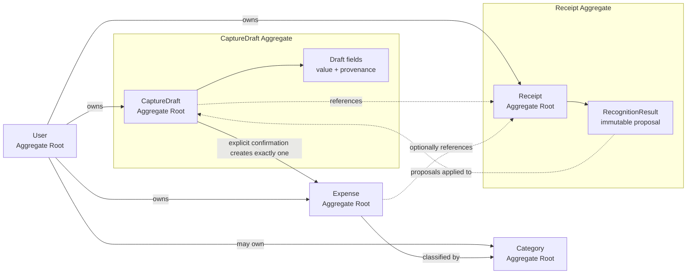

This proposal covers the business domain only.

# 1. Ubiquitous language

These terms should have one consistent meaning across product documentation, domain code, tests, and UI copy.

| Term | Definition |
|---|---|
| **User** | The owner of financial data and capture activity. Telegram is an identity/capture channel, not the User itself. |
| **Capture** | The process of collecting information that may become an Expense. It is a workflow, not necessarily an entity. |
| **CaptureDraft** | Mutable, unconfirmed expense information. It may originate from manual entry or a receipt. It is never included in financial history. |
| **Receipt** | A user-owned source document supporting a CaptureDraft and, after confirmation, an Expense. |
| **Recognition Pipeline** | An external processing capability that converts receipt content into proposed financial fields. It is not financial-domain logic. |
| **RecognitionResult** | An immutable result produced by one recognition attempt. It contains proposed fields and provenance, not confirmed financial facts. |
| **Proposal** | A suggested field value derived from recognition. A proposal may be accepted, corrected, or ignored. |
| **Correction** | A deliberate user change to a draft field. A correction takes precedence over recognition proposals. |
| **Review** | The stage in which the user sees the complete proposed Expense before confirmation. |
| **Confirmation** | An explicit user action that converts one CaptureDraft into exactly one Expense. |
| **Expense** | A confirmed financial record owned by a User. Only Expenses participate in history and analytics. |
| **Category** | A classification assigned to an Expense for organization and analytics. |
| **Merchant name** | User-confirmed text identifying where the expense occurred. It is not initially a reference to a merchant directory. |
| **Capture source** | The channel and method that originated a draft, such as Telegram manual entry or Telegram receipt photo. |
| **Transaction date** | The user-confirmed local calendar date on which the expense occurred. |
| **Financial history** | The collection of confirmed, non-deleted Expenses. |

## Terms to avoid

- **Transaction** as the primary record name: it is easily confused with database transactions, bank transactions, refunds, and transfers. Use `Expense`.
- **Receipt expense:** Receipt and Expense have distinct responsibilities.
- **Scanned receipt:** users may upload photographs; scanning is not required.
- **OCR as a domain concept:** too technology-specific. Use `Recognition Pipeline`, `RecognitionResult`, or `proposal`. OCR may be one implementation technique inside the pipeline.
- **Detected value:** implies more certainty than exists. Use `proposed value`.
- **Saved draft:** ambiguous because drafts are persisted but are not financial history.
- **Save expense** before confirmation: use `update draft`.
- **Automatic expense:** no receipt-derived value becomes an Expense automatically.
- **Locale** when language, country, currency, or timezone is actually meant.
- **PLN amount** or country-specific variants in core terminology.
- **Pending expense:** unconfirmed information is a `CaptureDraft`, not an Expense.

---

# 2. Core domain entities

## User

### Why it exists

User is the ownership boundary for expenses, receipts, and drafts.

It must remain independent of Telegram so that web authentication and future capture channels can attach to the same account.

### Responsibilities

- Own financial data.
- Hold preferences that affect presentation and capture defaults.
- Define the authorization boundary for domain operations.

### Essential attributes

- User identity.
- Account status.
- Default currency, if configured.
- UI language preference.
- Timezone.
- Optional locale preference.
- Creation timestamp.

Telegram identity belongs to identity/application concerns and need not be a core financial-domain entity.

### Lifecycle

```text
Active → Deactivated
```

Account deletion and anonymization require a product policy before persistence design.

### Invariants

- A deactivated user cannot start or confirm new captures.
- Ownership cannot be transferred between users in the MVP.
- A user preference is a hint or default, not a substitute for an Expense’s currency.

### MVP

Yes.

---

## CaptureDraft

### Why it exists

CaptureDraft separates uncertain, editable input from confirmed financial history.

It is essential to the confirmation-first model. An Expense with a `confirmed=false` flag would be dangerous because unconfirmed records could leak into analytics.

### Responsibilities

- Hold the current proposed Expense fields.
- Track whether fields came from manual input or recognition.
- Protect user corrections from delayed recognition.
- Control review, confirmation, cancellation, and expiration.
- Ensure one draft produces at most one Expense.

### Essential attributes

- Draft identity.
- Owner.
- Capture source.
- Current lifecycle state.
- Proposed amount and explicit currency.
- Proposed transaction date.
- Proposed merchant name.
- Proposed category.
- Optional note.
- Optional associated Receipt identity.
- Field provenance.
- Draft revision/version.
- Resulting Expense identity after confirmation.
- Creation, modification, expiration, and confirmation timestamps.

Not every proposed field has to be populated while the draft is being assembled.

### Lifecycle

```text
Collecting
   ├─→ AwaitingRecognition
   └─→ ReadyForReview

AwaitingRecognition
   ├─→ ReadyForReview
   ├─→ Collecting/ReadyForReview through manual entry
   └─→ ReadyForReview after recognition failure

ReadyForReview
   ├─→ ReadyForReview through correction
   └─→ Confirmed

Collecting / AwaitingRecognition / ReadyForReview
   ├─→ Cancelled
   └─→ Expired
```

Recognition failure is not a terminal draft failure. It results in a manually completable draft.

### Invariants

- Only the owner can edit, cancel, or confirm it.
- Terminal drafts cannot be edited.
- Confirmation requires all mandatory Expense fields.
- One draft creates at most one Expense.
- After confirmation, it records the resulting Expense.
- Recognition cannot overwrite manually corrected fields.
- A draft never appears in financial history or analytics.

### MVP

Yes.

---

## Receipt

### Why it exists

Receipt is more than a generic attachment because it has:

- Ownership.
- A processing lifecycle.
- Recognition attempts and outcomes.
- Independent failure behavior.
- Retention and deletion rules.
- A future path toward receipt items.

It remains a supporting concept, not the center of the financial model.

### Responsibilities

- Represent a receipt document owned by a User.
- Track whether it is available for recognition.
- Track current recognition-processing state.
- Associate recognition output with the correct image and draft.
- Preserve enough provenance to explain how proposals were produced.

### Essential attributes

At the domain level:

- Receipt identity.
- Owner.
- Document availability/status.
- Recognition-processing state.
- Active or most recent RecognitionResult reference.
- Creation timestamp.

Storage keys, hashes, MIME types, byte sizes, and provider metadata are important, but most belong to application/infrastructure models rather than the core financial domain.

### Lifecycle

```text
Received
   → Queued
   → Processing
      ├─→ Recognized
      └─→ RecognitionFailed

Queued / Processing / RecognitionFailed
   → Queued for an explicit retry

Received / Queued / Processing / Recognized / RecognitionFailed
   → Removed
```

A Receipt can be `RecognitionFailed` while its CaptureDraft remains editable and confirmable manually.

### Invariants

- Receipt ownership cannot change.
- A Receipt can only support a draft belonging to the same User.
- A removed Receipt cannot begin new recognition processing.
- A recognition result must refer to the correct Receipt and processing attempt.
- Receipt absence or recognition failure cannot prevent manual capture.

### MVP

Yes.

---

## RecognitionResult

### Why it exists

The domain needs an immutable record of what the recognition pipeline proposed so that:

- User corrections can take precedence.
- Delayed results can be rejected safely.
- Recognition quality can be evaluated.
- The origin of proposed fields remains explainable.

This should remain deliberately small.

### Responsibilities

- Carry normalized field proposals from the recognition boundary.
- Identify the Receipt and processing attempt.
- Preserve field-level provenance.
- Remain immutable after publication.

### Essential attributes

- Result identity.
- Receipt identity.
- Recognition attempt identity or version.
- Creation timestamp.
- Proposed merchant candidates.
- Proposed total candidates.
- Proposed transaction-date candidates.
- Proposed currency candidates.
- Optional document-context summary.
- Result-level source/version identifier.

It should not expose recognition-engine objects, raw tensors, provider-specific confidence types, or research metrics.

### Lifecycle

A RecognitionResult is created once and immutable. A retry produces a new result rather than modifying the previous one.

### Invariants

- It cannot confirm an Expense.
- It cannot directly modify confirmed financial history.
- It can only be applied to a mutable draft for the same owner and Receipt.
- Application of a result must respect the draft revision and field provenance.

### MVP

Yes, but keep it as an immutable supporting entity or snapshot. Do not turn it into a large recognition-research model.

---

## Expense

### Why it exists

Expense is the canonical financial fact and the center of history and analytics.

### Responsibilities

- Represent confirmed spending.
- Own its financial values.
- Support deliberate post-confirmation corrections.
- Participate in analytics.

### Essential attributes

- Expense identity.
- Owner.
- Money.
- Transaction date.
- Merchant name, optional if product policy allows.
- Category.
- Optional note.
- Capture source.
- Originating CaptureDraft identity.
- Optional Receipt identity.
- Creation and modification timestamps.
- Optional deletion status/timestamp.

### Lifecycle

An Expense is created already confirmed:

```text
Active
   ├─→ Active through edit
   └─→ Deleted
```

It does not need `Draft`, `Pending`, or `Confirmed` states. If it exists, it is confirmed.

Whether deletion is recoverable is an unresolved product decision. For commercial quality, a reversible soft deletion period is reasonable, but that is not yet a settled domain rule.

### Invariants

- Every Expense has an owner.
- Every Expense has a valid Money value with explicit currency.
- It originates from exactly one confirmation operation.
- Its owner must match the originating draft and Receipt.
- Deleted Expenses do not participate in ordinary history or analytics.
- Currency is never inferred from User locale or Receipt country.

### MVP

Yes.

---

## Category

### Why it exists

Categories support the MVP’s primary analytics: “Where did my money go?”

### Responsibilities

- Provide a stable classification identity.
- Provide the stable system categories available in the MVP.
- Remain referentially stable for historical Expenses.
- Control whether the category is available for new assignments.

### Essential attributes

- Category identity.
- Name or semantic key.
- Active status.
- Optional presentation metadata such as color or icon.

### Lifecycle

```text
Active → Inactive
Inactive → Active
```

Hard deletion is safe only when the category has never been used.

### Invariants

- System Categories are not owned by individual Users.
- Inactive Categories remain valid on historical Expenses.
- Inactive Categories cannot normally be assigned to new Expenses.
- System Category meaning should be stable even if its translated display label changes.

### MVP

Yes.

---

# 3. Aggregate boundaries

Recommended aggregate roots:

- `User`
- `CaptureDraft`
- `Receipt`
- `Expense`
- `Category`

`RecognitionResult` belongs beneath the Receipt boundary as immutable processing evidence, or may be treated as an immutable supporting record referenced by Receipt. It should not become an independently mutable aggregate.

## CaptureDraft aggregate

Owns:

- Draft lifecycle.
- Current proposed field values.
- Field provenance.
- Associated Receipt identity.
- Confirmation result identity.

Changes that must be atomic:

- Editing a field and marking its provenance as user-supplied.
- Applying eligible recognition proposals.
- Moving into review readiness.
- Recording successful confirmation and the resulting Expense identity.
- Cancellation or expiration.

Do not embed Receipt content or every recognition attempt inside CaptureDraft. Reference them by identity.

## Receipt aggregate

Owns:

- Receipt processing lifecycle.
- Current attempt identity.
- Acceptance of a RecognitionResult.
- Removal state.

Changes that must be atomic:

- Claiming a queued attempt for processing.
- Completing or failing the current attempt.
- Rejecting stale processing results.
- Marking the receipt removed.

The Receipt aggregate should not contain the Expense or CaptureDraft as child entities.

## Expense aggregate

Owns:

- Confirmed financial values.
- Post-confirmation edits.
- Deletion state.

Each Expense is small and independently mutable. Analytics reads across many Expense aggregates but does not modify them.

## Category aggregate

Owns:

- Category naming and availability.
- Activation/deactivation.

Expense only stores the Category identity. Category changes should not require loading all historical Expenses.

## Confirmation transaction

Confirmation crosses the CaptureDraft and Expense boundaries. The application service should perform one database transaction that:

1. Locks or version-checks the CaptureDraft.
2. Verifies ownership and confirmability.
3. Detects whether it was already confirmed.
4. Creates exactly one Expense.
5. Marks the draft confirmed.
6. Stores the resulting Expense identity.

Using one relational transaction across two small aggregates is appropriate. It does not require merging them into one large aggregate.

For a duplicate confirmation request, the operation should return the existing Expense rather than create another one.

---

# 4. Value objects

## Money — value object

Contains:

- Integer minor-unit amount.
- `CurrencyCode`.

Responsibilities:

- Validate representable amount.
- Prevent implicit arithmetic across currencies.
- Define same-currency addition and comparison.
- Avoid binary floating-point behavior.

The open question is whether MVP Expenses may have zero or negative values. Refund handling should be decided before persistence design.

## CurrencyCode — validated primitive wrapper

A small value object around an ISO 4217 code.

It should:

- Normalize to uppercase.
- Validate against supported ISO codes.
- Not derive itself from locale.
- Provide currency metadata through a separate catalogue where necessary.

Do not encode PLN or two-decimal assumptions. Some currencies have zero or three minor units.

## TransactionDate — value object or named date wrapper

This represents a local calendar date, not an instant.

A named wrapper is useful because it prevents confusion with:

- Receipt upload timestamp.
- Expense creation timestamp.
- Recognition timestamp.
- UTC audit timestamps.

Its validation may reject clearly impossible values, but rules for future dates need product agreement.

## MerchantName — restrained value object

A normalized non-empty text wrapper with:

- Whitespace normalization.
- Length limits.
- Preservation of user-visible text.

It should not perform aggressive merchant deduplication or country-specific normalization.

If merchant is optional, use `MerchantName | None`.

## Locale — validated primitive wrapper

Use a BCP 47-compatible tag where a locale is genuinely required.

Locale is not:

- Currency.
- Country.
- Language alone.
- Timezone.

A document-context locale is a hypothesis. A User locale is a preference.

## Timezone — validated primitive wrapper

Use an IANA timezone identifier.

It determines presentation and default local dates but does not alter already confirmed TransactionDates.

## CaptureSource — enum

A small enum is appropriate:

- Telegram manual.
- Telegram receipt.
- Web manual, if included in the MVP.

Do not create a value-object hierarchy for capture adapters.

## ReceiptProcessingState — enum

A state enum is appropriate:

- Received.
- Queued.
- Processing.
- Recognized.
- Recognition failed.
- Removed.

Retry count, timestamps, and failure details are not part of the enum.

## DraftField provenance — value object

A useful generic concept, provided it remains simple:

- Current value.
- Source: recognition, user, or default.
- Revision at which it was set.
- Optional RecognitionResult identity.

This supports the critical rule that delayed recognition cannot overwrite user correction.

It need not become a complicated generic framework in implementation. Separate explicit draft fields may be clearer in Python.

## CaptureDraftState — enum

- Collecting.
- Awaiting recognition.
- Ready for review.
- Confirmed.
- Cancelled.
- Expired.

## ExpenseStatus — enum only if deletion is retained in-domain

- Active.
- Deleted.

Do not add approved, processed, settled, or pending states.

---

# 5. Domain lifecycle

## Manual capture

```text
Start manual capture
→ Collecting
→ User supplies required fields
→ ReadyForReview
→ User edits if necessary
→ Explicit confirmation
→ Expense created
→ Draft becomes Confirmed
```

A default such as today’s date or the user’s default currency must be visibly reviewable and retain `default` provenance.

## Receipt capture

```text
Start receipt capture
→ Receipt received
→ Draft awaiting recognition
→ Recognition queued
→ Recognition processing
→ Result applied as proposals
→ Draft ready for review
→ User corrects fields
→ Explicit confirmation
→ Expense created
```

## Recognition failure

```text
Recognition processing
→ Receipt recognition failed
→ Draft remains editable
→ User manually supplies missing fields
→ Draft ready for review
→ Confirmation
```

Recognition failure must not force another upload.

## Manual correction before delayed recognition

If a user edits while recognition is still running:

- The field becomes user-supplied.
- The draft revision advances.
- A delayed RecognitionResult may populate untouched blank/default fields.
- It may not overwrite user-supplied fields.
- Alternative recognition values may be retained for diagnostics but should not silently change the review.

## Cancellation

A mutable draft may be cancelled by its owner.

- It cannot later be confirmed.
- Whether a cancelled receipt image is immediately deleted or retained briefly is a retention-policy decision.
- Reopening cancelled drafts should be omitted from the MVP.

## Expiration

Expiration is useful for abandoned drafts but should not happen during active user interaction.

- Only mutable drafts expire.
- Expired drafts cannot be confirmed.
- The user starts a new capture instead of reviving the old one.
- The exact expiration duration remains a product decision.

## Duplicate confirmation

Two confirmation requests may arrive concurrently.

The valid outcomes are:

- The first creates the Expense.
- The second returns the same resulting Expense.
- No second Expense is created.

This requires both domain idempotency and a persistence-level uniqueness guarantee later.

## Expense editing

A confirmed Expense may be edited directly from the web:

- It remains an Expense.
- It does not return to CaptureDraft.
- Receipt recognition must never reapply afterward.
- Ownership and currency rules still apply.

Whether significant edits require an audit trail is unresolved.

---

# 6. Domain invariants

1. Only confirmed Expenses participate in history and analytics.
2. CaptureDraft and RecognitionResult never participate in financial aggregation.
3. Every Expense has an explicit `CurrencyCode`.
4. Money in different currencies cannot be added or compared implicitly.
5. A User owns every CaptureDraft, Receipt, and Expense.
6. Ownership cannot change after creation.
7. A Receipt can be associated only with a draft and Expense owned by the same User.
8. Only the owner may view, edit, cancel, or confirm a CaptureDraft.
9. Only the owner may edit or delete an Expense.
10. Confirmation is always an explicit user action.
11. Recognition confidence can never bypass confirmation.
12. RecognitionResult contains proposals, not financial facts.
13. Recognition proposals may be applied only to a mutable matching draft.
14. A delayed RecognitionResult cannot overwrite a user-corrected field.
15. A stale recognition attempt cannot supersede a newer accepted attempt.
16. One CaptureDraft can create at most one Expense.
17. Confirmation is idempotent and returns the existing Expense after a successful earlier confirmation.
18. A confirmed, cancelled, or expired draft cannot be edited.
19. Confirmation requires every mandatory Expense field to be valid.
20. Expense owner, draft owner, and Receipt owner must match.
21. Category assignment must use a system Category or a Category owned by the Expense owner.
22. Deactivating a Category does not invalidate historical Expenses.
23. Recognition failure does not prevent manual completion.
24. Removing a Receipt does not automatically delete its confirmed Expense.
25. Post-confirmation recognition cannot mutate an Expense.
26. Deleted Expenses do not participate in normal analytics.
27. User defaults are proposals, not substitutes for explicit persisted Expense values.

---

# 7. Internationalization boundaries

## Financial domain

The financial domain owns:

- Explicit Expense currency.
- Money rules.
- User-confirmed transaction date.
- User-confirmed merchant text.
- User-selected category.
- User timezone preference.
- User interface language preference.
- Capture source.
- Confirmed field values.

## Recognition boundary

Recognition/application infrastructure owns:

- Recognition language hints.
- Text blocks and coordinates.
- Document-language hypotheses.
- Country hypotheses.
- Locale hypotheses.
- Currency proposals.
- Country/language-specific vocabularies.
- Decimal and date parsing strategies.
- Recognition-provider metadata.
- Raw recognition diagnostics.

## Separate concepts

| Concept | Meaning |
|---|---|
| Document language | Language observed in the receipt text. May be multiple or unknown. |
| Likely country | Recognition hypothesis about receipt jurisdiction. |
| Document locale | Formatting hypothesis used to interpret dates and amounts. |
| Expense currency | Confirmed ISO currency code and financial fact. |
| UI language | User preference for MintFlow presentation. |
| User timezone | User preference for dates, defaults, and analytics boundaries. |

None should determine another unconditionally.

A German-language receipt may use CHF, a Ukrainian user may upload a Polish receipt, and an English UI may be used in any country.

---

# 8. Recognition data

The MVP should preserve only what supports review, correctness, and basic evaluation.

## RecognitionResult should retain

- Receipt identity.
- Attempt/result identity.
- Result timestamp.
- Pipeline configuration or version identifier.
- Proposed merchant candidates.
- Proposed total candidates.
- Proposed date candidates.
- Proposed currency candidates.
- Candidate confidence or ranking.
- Minimal context hypotheses where required to interpret candidates.
- Field-level provenance back to normalized source evidence.

## CaptureDraft should retain

For each relevant field:

- Current value.
- Source:
  - recognition,
  - user,
  - or explicit default.
- RecognitionResult identity if recognition supplied it.
- Revision or equivalent protection against stale writes.

## Expense should retain

- Final user-confirmed values.
- Originating CaptureDraft identity.
- Optional Receipt identity.
- Capture source.

The Expense does not need confidence scores or raw recognition output.

## Deliberately avoid

- Provider-specific recognition response structures in the domain.
- Every text token as a domain entity.
- Research annotations.
- Model-comparison entities.
- Character-level corrections.
- Full recognition event sourcing.
- Multiple simultaneous winning results.
- Line-item structures.

Raw Recognition Pipeline output may be stored outside the domain for diagnostics under a defined retention policy, but the business model should not depend on it.

---

# 9. Category model

Use system categories only in the MVP. User-defined categories are intentionally postponed.

## System categories

Provide this initial international semantic set:

- Groceries.
- Food & Dining.
- Transport.
- Shopping.
- Housing.
- Utilities.
- Health.
- Entertainment.
- Travel.
- Education.
- Gifts.
- Other.
- Uncategorized.

The stored identity should represent stable meaning, not an English display label. Display labels can be localized.

## Deletion

System categories are not user-deletable. Historical Expenses retain their Category identity. Catalogue evolution must preserve stable semantic identities.

## Hierarchy

Do not implement category hierarchy.

It complicates:

- Selection.
- Aggregation.
- Reparenting.
- Historical interpretation.
- Localization.

Flat categories are sufficient for the first 100 users.

---

# 10. Merchant handling

Do not create a Merchant aggregate in the MVP.

## Store three concepts where needed

### Original recognized text

Kept with RecognitionResult or proposal provenance.

Example:

```text
"BIEDRONKA 1234 WARSZAWA"
```

This is evidence, not final financial data.

### User-confirmed merchant name

Stored directly on Expense as `MerchantName`.

Example:

```text
"Biedronka"
```

This is what history and the expense detail display.

### Analytics grouping key

A basic normalized key may be derived from the confirmed name:

- Unicode-aware case folding.
- Whitespace normalization.
- Conservative punctuation handling.
- Possibly removal of clearly non-semantic repeated spacing.

Avoid aggressive removal of branch numbers, locations, or legal suffixes until behavior is tested internationally.

For MVP analytics, grouping by a conservative normalized merchant-name key is adequate.

## Future normalization

A later Merchant capability could add:

- User-managed aliases.
- Canonical merchant identities.
- Branch relationships.
- Logos and enrichment.
- Cross-language normalization.

None warrants a Merchant entity now.

A correction to one Expense’s merchant should not automatically rewrite other Expenses.

---

# 11. Conceptual domain diagram



Lifecycle boundaries:

```text
Recognition Pipeline
        │
        ▼
RecognitionResult
        │ proposals only
        ▼
CaptureDraft ── explicit confirmation ──▶ Expense
                                            │
                                            ▼
                               history and analytics
```

The Recognition Pipeline is outside the business-domain boundary.

---

# 12. Initial application use cases

## User and preferences

- Create or resolve User from an authenticated identity.
- View user preferences.
- Update default currency.
- Update UI language.
- Update timezone.

## Manual capture

- Start manual capture.
- Set draft amount and currency.
- Set draft transaction date.
- Set draft merchant.
- Set draft category.
- Set draft note.
- Mark draft ready for review.

## Receipt capture

- Start receipt capture.
- Associate received Receipt with CaptureDraft.
- Mark Receipt queued for recognition.
- Mark recognition processing started.
- Record recognition success.
- Record recognition failure.
- Apply RecognitionResult proposals to a draft.
- Retry failed recognition, if permitted.

## Draft management

- View current draft.
- Edit one or more draft fields.
- Prepare review summary.
- Confirm draft.
- Handle duplicate confirmation.
- Cancel draft.
- Expire abandoned drafts.

## Expenses

- View Expense.
- Edit confirmed Expense.
- Delete Expense.
- Restore Expense, only if recoverable deletion is selected.
- List Expense history.
- Filter history by date, category, and currency.

## Categories

- List available system Categories.

## Analytics

- Calculate total spending by currency.
- Calculate category summary by currency.
- Calculate spending trend by currency.
- Compare periods without implicit currency conversion.
- Calculate merchant summary by currency.
- Drill from an analytics result into matching Expenses.

These are application use cases, not necessarily one class per use case.

---

# 13. Risks and trade-offs

## Too many aggregate roots

Five aggregate roots may look substantial for an MVP, but each has an independent lifecycle:

- User ownership.
- Draft confirmation.
- Receipt processing.
- Expense editing.
- System Category catalogue evolution.

Merging Receipt into CaptureDraft would make asynchronous processing and retention harder. Merging Draft into Expense would threaten analytics correctness.

## RecognitionResult may become overmodeled

The main risk is allowing benchmark and recognition-research requirements to expand the business domain.

Keep only field proposals, provenance, context required for interpretation, and version identity. Store detailed engine output outside the domain if needed.

## Draft state explosion

It is tempting to encode every Telegram screen as a domain state.

Do not do this. States such as `ENTERING_AMOUNT` or `CHOOSING_CATEGORY` belong to bot conversation state. Domain states should express business lifecycle only.

## Race between correction and recognition

A worker may finish while the user edits.

Mitigation requires:

- Draft versioning.
- Field provenance.
- Attempt identity.
- Conditional application of proposals.
- Atomic draft updates.

A simple “last write wins” policy is unacceptable.

## Duplicate confirmation

Telegram callbacks and HTTP requests can be retried. Domain idempotency alone is insufficient; persistence will later need a uniqueness guarantee linking one draft to one Expense.

## Category localization

System Category identity must not be its display string. Otherwise changing language could fragment analytics.

## Merchant grouping quality

Naive normalization may either split one merchant or merge distinct merchants. Conservative grouping is preferable. Users can tolerate slightly fragmented merchant analytics more easily than incorrect merging.

## Post-confirmation audit history

If an Expense is edited, MintFlow may need to explain what changed. A complete event-sourcing model would be excessive, but no audit record at all may be weak for a commercial product.

A lightweight audit policy should be decided before persistence design.

## Receipt deletion and Expense independence

Deleting a Receipt should not silently delete the confirmed Expense. The user may want to remove sensitive images while retaining financial history.

## Privacy

Receipt images and recognition results may contain:

- Addresses.
- Partial payment-card information.
- Medical purchases.
- Loyalty identifiers.
- Employee or cashier identifiers.
- Location and behavioral data.

The domain must support independent Receipt removal and minimal data retention.

## User deletion

Hard deletion, delayed deletion, and anonymization requirements affect ownership relationships. This policy should be resolved before database foreign keys and deletion behavior are designed. Full data export is postponed until after the MVP.

## Negative expenses and refunds

Prohibiting negative Money simplifies analytics but leaves refunds unresolved. Allowing negative Expenses without defining their meaning may also corrupt insights. This is a product decision, not merely validation.

---

# 14. Final recommendation

## Smallest recommended MVP domain

Use these aggregate roots:

1. `User`
2. `CaptureDraft`
3. `Receipt`
4. `Expense`
5. `Category`

Use one immutable supporting entity/snapshot:

- `RecognitionResult`, owned conceptually by Receipt.

Use these core value types:

- `Money`
- `CurrencyCode`
- `TransactionDate`
- `MerchantName`
- `Locale`
- `Timezone`

Use these enums:

- `CaptureSource`
- `CaptureDraftState`
- `ReceiptProcessingState`
- Optional `ExpenseStatus`
- Field provenance source

Do not add a Merchant aggregate. Do not treat Telegram identity as the financial User. Do not represent unconfirmed input as Expense.

## Deliberately postpone

- Receipt line items.
- Merchant directory.
- Merchant alias aggregate.
- Budgets.
- Recurring payments.
- Transfers and bank transactions.
- Bank accounts.
- Family or shared ownership.
- Subscription and billing entities.
- Exchange-rate entities.
- Converted Money.
- AI insight entities.
- Recognition model registry.
- Multiple concurrent recognition-provider result selection.
- Category hierarchy.
- User-defined categories.
- Merchant search.
- Full domain event store.
- Detailed recognition-token domain model.

## Product decisions resolved before persistence design

The finalized recommendations are recorded in `product_decision_review.md`. The list below remains as the persistence-design checklist.

1. **Refunds:** Are negative Expenses allowed, or are refunds deferred?
2. **Zero amounts:** Can a confirmed Expense have a zero total?
3. **Mandatory fields:** Are merchant and category required, or only amount, currency, and date?
4. **Missing date:** Should the current local date be proposed automatically?
5. **Future dates:** Are future-dated Expenses allowed?
6. **Expense deletion:** Hard delete, recoverable soft delete, or archive?
7. **Expense edit history:** Which post-confirmation changes must be auditable?
8. **Receipt deletion:** Can users delete the image while retaining the Expense?
9. **Receipt retention:** How long are cancelled and expired draft images retained?
10. **Draft expiration:** When does an abandoned draft expire?
11. **Recognition retention:** How long are raw results and field proposals retained?
12. **User deletion:** Immediate deletion, grace period, or another policy?
13. **System categories:** What is the initial semantic category set, and is `Other` always available?
14. **Category requirement:** Can an Expense remain uncategorized?
15. **Currency catalogue:** ISO 4217 fiat currencies only for MVP?
16. **Amount limits:** What maximum amount should guard against recognition and input errors?
17. **Receipt reuse:** Must one Receipt belong to exactly one CaptureDraft?
18. **Post-confirmation correction:** Can confirmed Expense currency be changed?
19. **Analytics periods:** Are month boundaries always calculated in the User’s current timezone?
20. **Confirmation evidence:** Is storing confirmation timestamp and channel sufficient, or is a separate audit record required?

The most important model decision is firm: `CaptureDraft` and `Expense` must remain separate. That boundary guarantees that uncertain recognition output and unfinished manual entry can never enter financial history before explicit confirmation.
